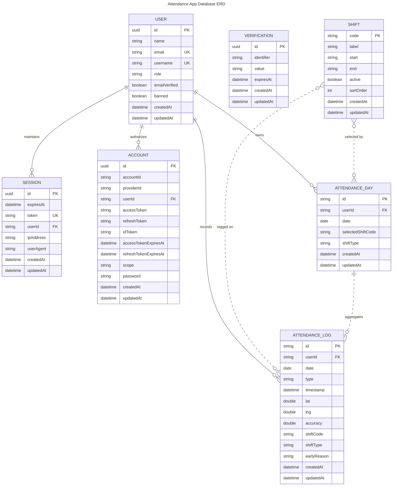

# Attendance App Database Schema

The diagram below captures the primary tables managed by Drizzle (PostgreSQL) along with their key attributes and relationships used across the attendance system.

**Notes**

- `ATTENDANCE_DAY` and `ATTENDANCE_LOG` reference shifts by code rather than a hard foreign key, so the relationships to `SHIFT` are depicted as optional (dashed).
- `ATTENDANCE_DAY` aggregates logs for the same user and date; although enforced via `(userId, date)` in application logic, this association is illustrated for clarity.
