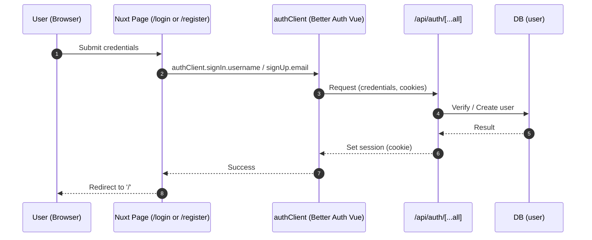
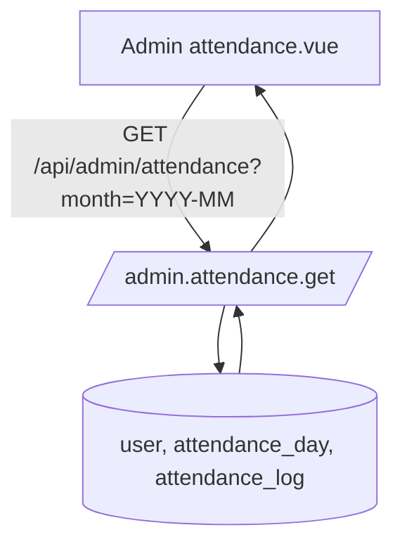
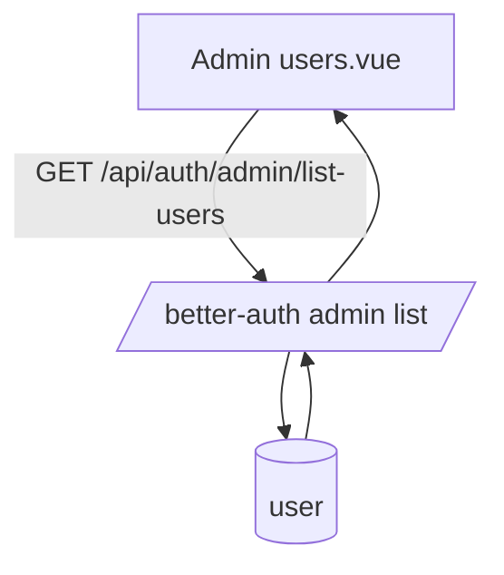

# Attendance App Flowcharts

Below are Mermaid diagrams describing the app’s primary flows.

## High-Level Overview
```mermaid
flowchart TD
  subgraph Client [Nuxt Client]
    A[Visitor] -->|/login, /register| B[Auth Pages]
    A -->|/| C[Dashboard (index.vue)]
    A -->|/admin/*| D[Admin Layout]
  end

  subgraph Middleware
    M1[auth.global] -->|guards all routes by default| C
    M1 --> B
    M2[admin] -->|ensures admin role| D
  end

  subgraph Auth[Better Auth]
    BA1[/username sign-in/]
    BA2[/email sign-up/]
    BA3[/session handling/]
  end

  subgraph API[Nitro Server API]
    S0[/health, shifts/]
    S1[/attendance: index, clock-in, clock-out, reset, shift/]
    S2[/admin: attendance, users/]
    SAuth[/auth handler/]
  end

  subgraph DB[SQLite via Drizzle]
    T1[(user)]
    T2[(shift)]
    T3[(attendance_day)]
    T4[(attendance_log)]
  end

  B -->|authClient.signIn/signUp| BA1 --> SAuth --> T1
  B --> BA2 --> SAuth --> T1
  C -->|useAttendance.refresh| S1 --> T3 & T4
  C -->|Clock In/Out/Reset/Set Shift| S1 --> T3 & T4 & T2
  D -->|Admin Attendance| S2 --> T1 & T3 & T4
  D -->|Admin Users| S2 --> T1
  S0 --> T2
```

## Login / Register


## Dashboard: Clock In / Out
```mermaid
flowchart LR
  subgraph UI
    D0[Dashboard index.vue]
    D1[useAttendance.refresh]
    D2[Clock In]
    D3[Clock Out]
    D4[Reset Day]
    D5[Set Shift]
  end

  D0 --> D1
  D1 -->|GET /api/attendance| A1

  D2 -->|POST /api/attendance/clock-in {shiftCode, coords}| A2
  D3 -->|POST /api/attendance/clock-out {coords}| A3
  D4 -->|POST /api/attendance/reset| A4
  D5 -->|POST /api/attendance/shift {shiftCode}| A5

  subgraph API
    A1[/attendance.index.get/]
    A2[/attendance.clock-in.post/]
    A3[/attendance.clock-out.post/]
    A4[/attendance.reset.post/]
    A5[/attendance.shift.post/]
    SH[/shifts.get/]
  end

  subgraph DB
    T2[(shift)]
    T3[(attendance_day)]
    T4[(attendance_log)]
  end

  A1 --> T3 & T4
  A2 --> T3 & T4
  A3 --> T4
  A4 --> T3 & T4
  A5 --> T3
  D0 -.on mount.-> SH --> T2
```

## Admin: Monthly Attendance


## Admin: Users


Notes
- Admin access is restricted by `NUXT_ADMIN_EMAILS` and `admin` middleware.
- `auth.global` treats routes without `definePageMeta({ auth: { unauthenticatedOnly: true } })` as authenticated-only.
- All attendance APIs require an active session.
